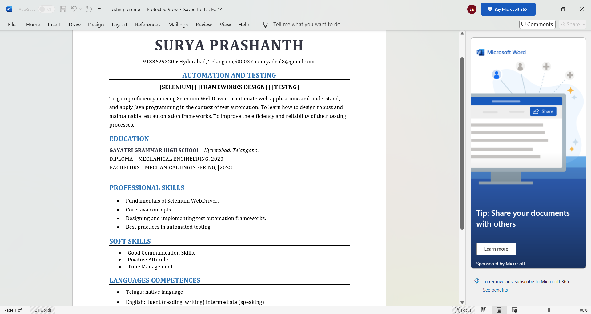
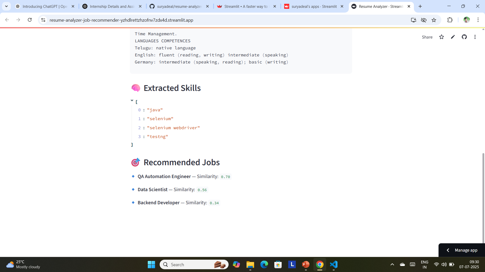

# 📄 Resume Analyzer & Job Recommender

An AI-powered web app that extracts skills from resumes and recommends job roles using NLP and ML.

---

## 🚀 Features

- 📤 Upload `.txt` or `.docx` resume files
- 🧠 Extract skills using spaCy
- 📊 Recommend top 3 job roles using TF-IDF + Cosine Similarity
- 🌐 Deployed on Streamlit Cloud

---

## 📸 Screenshots

### 📝 Resume Upload Page


### 🧠 Skills Extraction & Job Recommendations

---

## ✅ How It Works

1. Upload a resume
2. Skills are extracted using spaCy
3. Resume & job descriptions are vectorized using TF-IDF
4. Cosine similarity calculates matching scores
5. Top 3 jobs are recommended

---

## 📦 Setup Locally

```bash
git clone https://github.com/suryadeal/resume-analyzer-job-recommender.git
cd resume-analyzer-job-recommender
pip install -r requirements.txt
streamlit run streamlit_app.py
